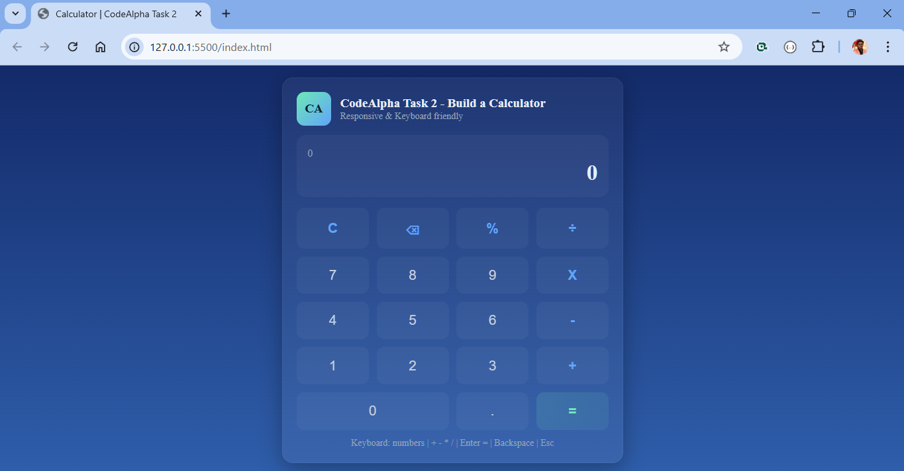
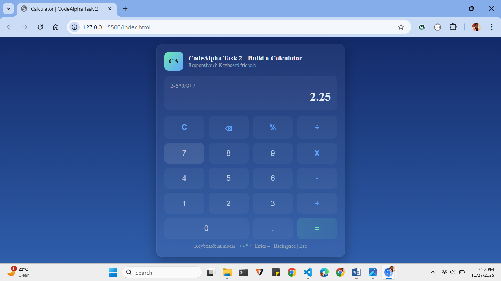

🧮 CodeAlpha Task 2 – Responsive Calculator

A clean, modern, and fully responsive Calculator Web App built using HTML, CSS, and JavaScript.
It supports both button clicks and full keyboard input ⌨️, making it smooth and efficient to use!

---

🚀 Live Demo

Access the live deployed calculator here:  
▶ **https://dt1111rc.github.io/CodeAlpha_Calculator/**  


---

✨ Features :

⚡ Real-time expression & result preview
🔢 Supports decimals, percentages, and chained operations
🖱️ Clickable UI + complete keyboard support
📱 Fully responsive design for all screen sizes
💡 Smart input handling (prevents multiple decimals, invalid operators, etc.)
🎨 Modern glass-UI theme with subtle animations

---

## Tech Stack

| Technology | Purpose |
|-----------|----------|
| **HTML5** | Structure and layout |
| **CSS3** | Styling, responsiveness, animation |
| **JavaScript (ES6)** | Logic handling, events, real-time updates |

---

📂 Project Structure
```
📁 Calculator-App
│── index.html     # Main UI structure
│── styles.css     # Styling & responsive design
└── script.js      # Calculator logic & keyboard supporttation
```
---

🚀 How to Use

1. Clone or download this repository  
2. Open the project folder  
3. Run **index.html** in any modern browser  
4. The calculator will work instantly — no installation required😄

---

⌨️ Keyboard Shortcuts
| Key       | Action                |
| --------- | --------------------- |
| 0–9       | Enter numbers         |
| + - * /   | Operators             |
| .         | Decimal point         |
| Enter / = | Evaluate expression   |
| Backspace | Delete last character |
| Esc       | Clear all             |

---
📷 Screenshots
### Home Screen  


### Performing a Calculation  


## Learning Outcomes

This project strengthened my understanding of:

- DOM manipulation  
- Event-driven programming  
- Clean UI/UX design  
- JavaScript computational logic  
- Responsive layout development  
- Code structuring and optimization  

---

📜 Internship Details

This project was created as part of the  
**CodeAlpha Frontend Development Internship – Task 2**.

---

👨‍💻 Author

**DEBARGHYA CHOWDHURY | Final Year CSBS Student | IEM KOLKATA**  
GitHub: https://github.com/dt1111rc


---

## Feedback & Contribution

Suggestions and improvements are welcome.  
Feel free to open an issue or submit a pull request.

